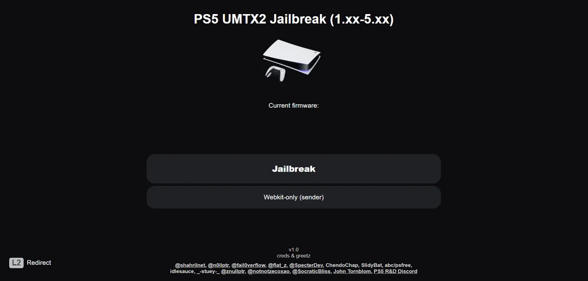

# PS5_EZ_Host by _-stuey-_
Modern UMTX2 ESP32-S3 Jailbreak Host (v1.0)

  

---

## What Is This?

PS5_EZ_Host is a self-contained, no-fuss jailbreak platform for PlayStation 5 firmware 1.xx–5.xx, built on the UMTX2 WebKit exploit and optimized for ESP32-S3 boards (16MB flash). This is the only known host offering:

- Clean two-stage exploit UI (launch → payloads)
- Built-in file manager (`/admin.html`) for hot-swapping `.bin` / `.elf` payloads
- SPIFFS-based hosting — no SD card needed
- Gzip-capable payload support
- Auto-flashing via `auto_flash.exe` (no Arduino or Python required)
- Compatible with any 16MB ESP32-S3 board using CP210x USB

---

## Flashing Instructions

1. Plug your ESP32-S3 board into a USB port  
   (CP210x USB UART recommended — see driver link below)

2. Double-click `auto_flash.exe`

3. Let it flash all four images:
   - Bootloader
   - Partition Table
   - Firmware
   - SPIFFS Web Content

4. Important:  
   Do not close or exit the command prompt window until it says:  
   `Hard resetting via RTS pin...`  
   This can take up to 20 seconds after flashing appears to be finished.

---

## How to Use

- Connect your PS5 or PC to the Wi-Fi network:  
  SSID: PS5_EZ_HOST  
  Password: (leave blank)

- Open the browser and go to:  
  http://10.1.1.1

- Launch the exploit and send payloads from the list.

---

## File Manager (Payload Hot-Swap)

Access the SPIFFS file manager at:  
http://10.1.1.1/admin.html

Use it to:
- Upload new `.bin` or `.elf` payloads
- Delete or replace existing files
- Download files for editing or backup

Note:  
If you upload a new version of a payload, use the **exact same filename** (e.g., `etaHEN.bin`) unless you're editing `payload_map.js` to reference the new name.

---

## USB Drivers (If Board Isn't Detected)

If your board isn't detected or `auto_flash.exe` fails to connect, install the CP210x USB-to-UART drivers:

https://www.silabs.com/developers/usb-to-uart-bridge-vcp-drivers

Then try flashing again.

---

## Credits

- UMTX2 WebKit Exploit: [idlesauce](https://github.com/idlesauce)
- Payload Support: [LightningMods](https://github.com/LightningMods/etaHEN), [EchoStretch](https://github.com/EchoStretch/kstuff)
- ESP32 Host Integration: _-stuey-_
- Core Contributors: @shahrilnet, @n0llptr, @fail0verflow, @flat_z, @SpecterDev, ChendoChap, SlidyBat, abc/psfree, idlesauce, @znullptr, @notnotzecoxao, @SocraticBliss, John Tornblom, PS5 R&D Discord

---

“No reflashing. No IDE. No dependencies. Just plug, flash, and go.”

